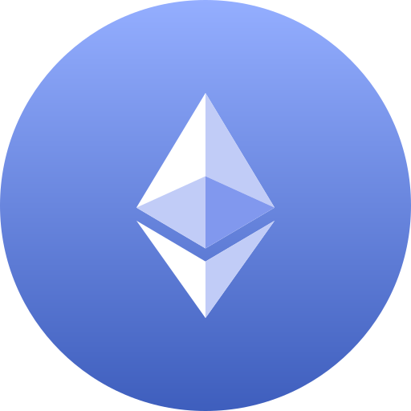

# 💫 About Me
As a senior full-stack and blockchain engineer with seven years of experience, I have a proven record of delivering scalable web applications and innovative blockchain solutions.
I bring a forward-thinking, problem-solving approach to each project, grounded in a commitment to quality and efficiency. My work style emphasizes collaboration and adaptability, allowing me to excel in diverse, global teams and align with client needs across time zones.
I am dedicated to building lasting client relationships through technical excellence, proactive support, and a continuous drive for innovation

# 💻 My Main Skills:

<table align="center">
    <tr>
        <td align="center" width="96">
            
             Solidity
        </td>
        <td align="center" width="96">
            
             Rust
        </td>
        <td align="center" width="96">
            
             Go
        </td> 
        <td align="center" width="96">
            
             Ethereum
        </td>    
        <td align="center" width="96">
            
             Solana
        </td>              
    </tr>
    <tr>
        <td align="center" width="96">
            
             JavaScript
        </td> 
        <td align="center" width="96">
            
             TypeScript
        </td> 
        <td align="center" width="96">
            
             React
        </td> 
         <td align="center" width="96">
            
             Next.js
        </td>
        <td align="center" width="96">
            
             Vue
        </td>              
    </tr>
    <tr>
        <td align="center" width="96">
            
             Python
        </td>
        <td align="center" width="96">
            
             Node.js
        </td> 
        <td align="center" width="96">
            
             AWS
        </td>
        <td align="center" width="96">
            
             Docker
        </td>  
    </tr>
</table>
  

